# YOLO Classification Fine-Tuning (Under Development 🚧)

This project provides a simple and reproducible pipeline for fine-tuning the **YOLO Classification (YOLO-CLS)** models on custom image classification datasets.

The top three best-performing models achieve high accuracy:

<div align="center">

| Model | Accuracy (Validation Set) | Accuracy (Test Set) |
| --------- | ------ | ------ |
| Yolo11x-cls | 95% | 97% |
| Yolo26x-cls | 96% | 96% |
| Yolov8x-cls | 94% | 96% |

</div>

## Tunisian Food Dataset
The dataset used in this project is a collection of images of Tunisian food dishes found on the internet. It contains 11 classes, each with 100 images, totaling 1100 images.

| Assida | Baklava | Brik | Chapati |
|:-------:|:----------:|:----:|:--------:|
|  |  | 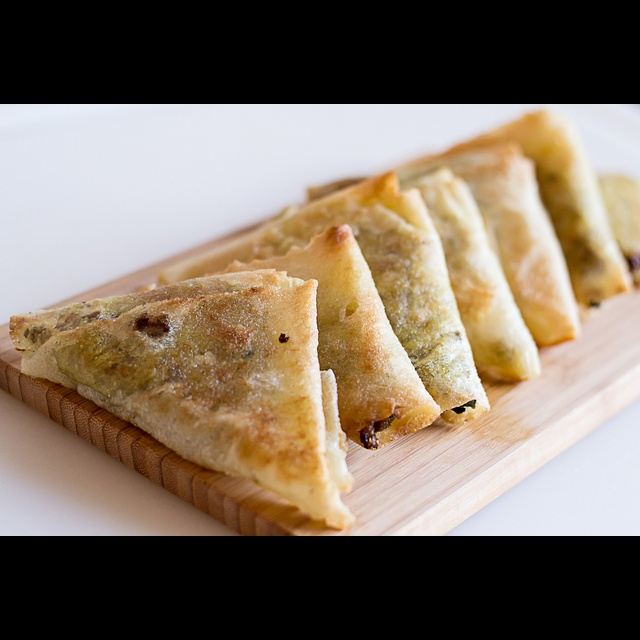 | 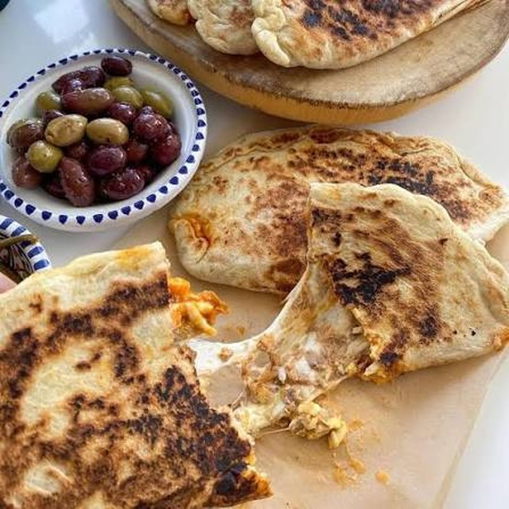 |

| Couscous | Fricasse | Ghraiba | Kaak Warka |
|:---------:|:-------:|:--------:|:---------:|
| 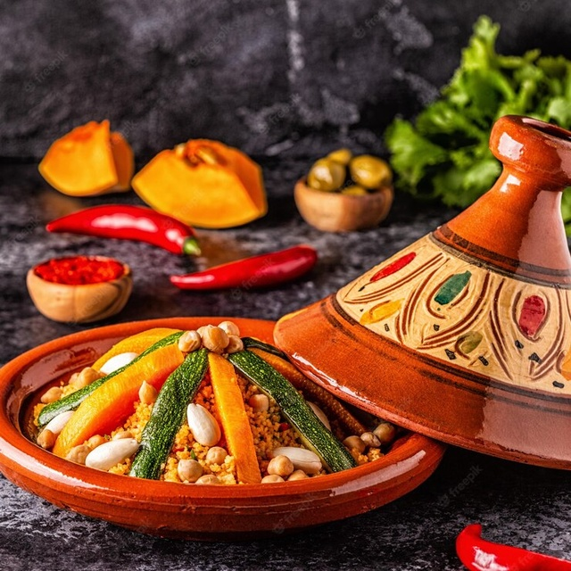 | 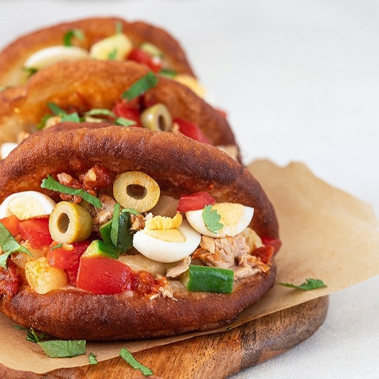 |  |  |

| Leblebi | Makroud | Mloukhia |
|:----:|:--------------:|:------:|
| 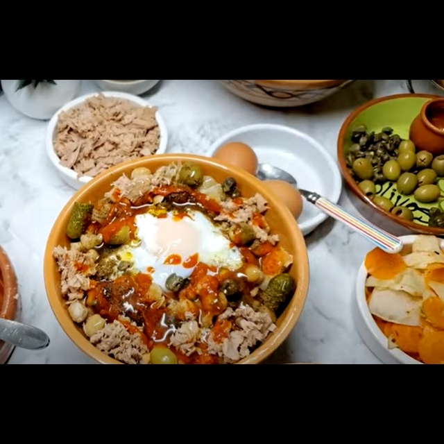 | 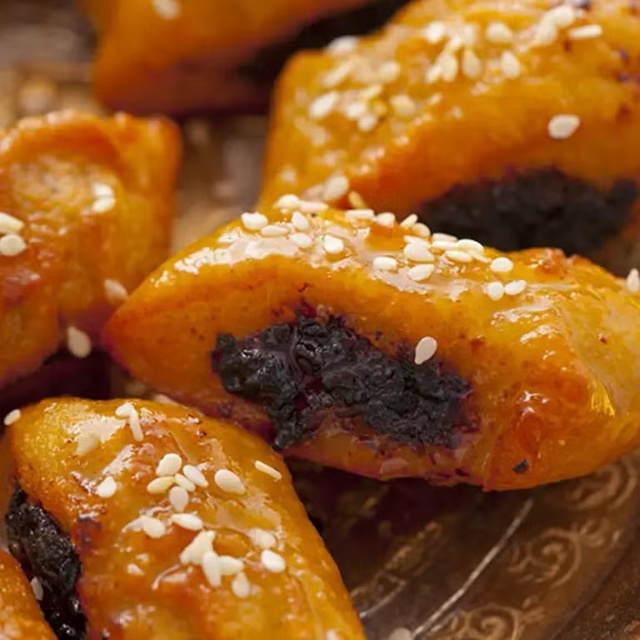 | 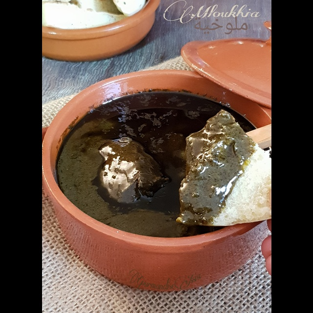 |

The total 1100 images are split into training, validation, and test sets as follows:
- Training set: 70% (770 images, with 70 images per class)
- Validation set: 15% (165 images, with 15 images per class)
- Test set: 15% (165 images, with 15 images per class)

## Code Structure

### [Training Pipeline](src/training_pipeline.py) ([Training Configuration](configs/train.yaml))

The training pipeline contains all the necessary steps to train a YOLO-CLS model on a custom dataset. It includes data preprocessing, train/validation/test split, model training, and evaluation. The pipeline is designed to be modular and easily configurable through the [configs/train.yaml](configs/train.yaml) configuration file.

Here are some of the most important parameters in the configuration file:

| Parameter                  | Type    | Description |
|----------------------------|---------|-------------|
| `img_size`             | tuple     | The size of the input images for the model. |
| `train_ratio`             | float     | The ratio of the dataset to be used for training. |
| `val_ratio`             | float     | The ratio of the dataset to be used for validation. (The remaining portion is used for testing) |
| `models`             | list     | A list of Yolo models to be used for training. All models in the list will be trained sequentially. |

The main steps of the training pipeline are as follows:
1. **Data Preprocessing**: The images are loaded from the `input_dir` directory and resized to the specified `img_size`. A new directory `dataset` is created to store three subdirectories: `train`, `val`, and `test`, each containing the corresponding images for training, validation, and testing.
2. **Model Training and Evaluation**: For each model specified in the `models` list, the model is trained on the training set and evaluated on the validation/test set. The training results, including the predictions, evaluation metrics, and summary report, are saved in the `outputs` directory for later analysis.

## Experiments and Performance Analysis
Nine models were trained on the Tunisian food dataset, and their performance was evaluated on the validation and test sets.
The configuration of the training experiment are as follows:
- `img_size`: (640, 640)
- `train_ratio`: 0.7
- `val_ratio`: 0.15
- `models`: [yolov8m-cls, yolov8l-cls, yolov8x-cls, yolo11m-cls, yolo11l-cls, yolo11x-cls, yolo26m-cls, yolo26l-cls, yolo26x-cls]
- `batch_size`: 8
- `epochs`: 12
- `learning_rate`: 0.0001
- `optimizer`: adamW
- GPU: NVIDIA GeForce RTX 3060 (6 GB VRAM)
- CPU: AMD Ryzen 5 5600H Processor


### Train and validation loss curves for all models:
<div style="text-align: center;">
    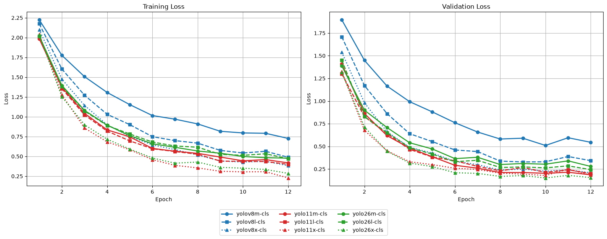
</div>

### Validation and test accuracy for all models:
<div style="text-align: center;">
    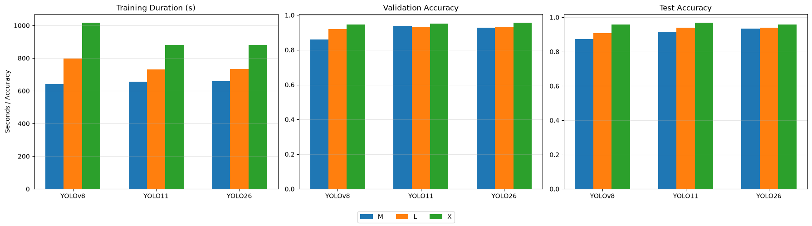
</div>

As shown in the above figures, the best-performing models are the `x` variants of the YOLO family, achieving the highest accuracy on both the validation and test sets. This is expected since the `x` models have the largest capacity (more parameters and higher representational power), allowing them to learn more complex visual features from the dataset. Among them, **`yolo11x-cls` achieves the best performance with a 97% test accuracy**.

### Confusion matrix for the best model Yolo11x-cls:
<div style="text-align: center;">
    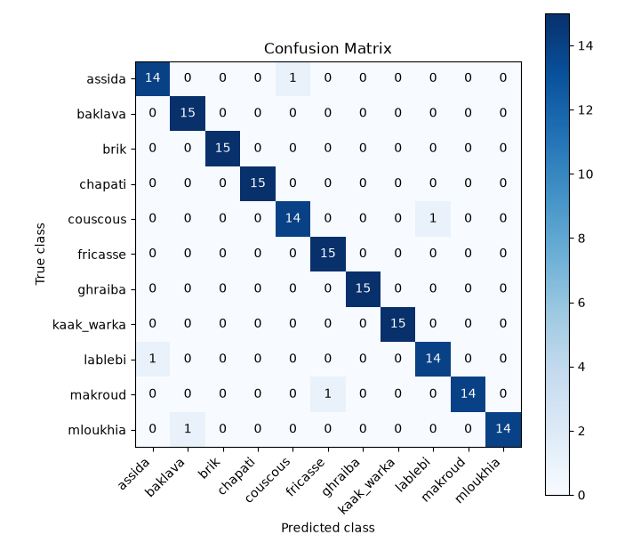
</div>

## Bring Your Own Dataset
The project is **not limited to food classification**. The entire training pipeline has been designed to be reusable for any image classification problem. Simply clone the repository and replace the dataset with your own.

The only requirement is to organize your images with **one folder per class** inside the `data_raw` directory:

```text
data_raw/
├── class_1/
│   ├── image1.jpg
│   ├── image2.jpg
│   └── ...
├── class_2/
│   ├── image1.jpg
│   └── ...
└── class_n/
```

Supported image formats are: `.jpg`, `.jpeg`, `.png`, `.webp` and `.avif`.

### Example Applications

Once you have a labeled image dataset, the pipeline can be used for many image classification tasks, for example:

- 🛒 **Retail & Self-checkout** – Automatically recognize products at a self-service checkout.
- 🌱 **Agriculture** – Classify plant species, fruits, or crop diseases from images.
- 🏭 **Manufacturing** – Detect and classify product types or manufacturing defects.
- 🩺 **Healthcare** – Categorize medical images into predefined diagnostic classes.
- 📦 **Inventory Management** – Automatically classify products in warehouses or logistics centers.
- ♻️ **Waste Sorting** – Classify recyclable materials for automated sorting systems.

## Installation

### 1. Install `uv`

#### Linux
```bash
curl -Ls https://astral.sh/uv/install.sh | sh
```
#### Windows
```bash
powershell -c "irm https://astral.sh/uv/install.ps1 | iex"
```

### 2. Clone the repository and install dependencies
```bash
git clone https://github.com/Lahdhirim/CV-Yolo-classifier-azure.git
cd CV-Yolo-classifier-azure
uv sync
```
### 3. Run the training pipeline
```bash
uv run main.py train --config configs/train.yaml
```

### 4. Select the best models and run the model registration pipeline
```bash
uv run main.py register_models --config configs/model_registration.yaml 
```

## Azure Deployment

### 1. Install Azure CLI and log in to your Azure account

1. Download and install the Azure CLI (Version 2.87.0) from the official GitHub release page: [https://github.com/Azure/azure-cli/releases#release-azure-cli-2.87.0](https://github.com/Azure/azure-cli/releases#release-azure-cli-2.87.0)

> **Note (July 2026):** Avoid using the last Azure CLI version (**2.88.0**). Installing the Azure Machine Learning (`ml`) extension may fail due to a compatibility issue (`BackendUnavailable: Cannot import 'maturin'`). Use **Azure CLI 2.87.0** instead.

2. Open PowerShell and run:

    ```bash
    az login
    az extension add --name ml -y
    ```

### 2. Create your Azure resources
1. Create a resource group (it is recommended to follow the naming convention `rg-<project_name>-<environment>`):
    ```bash
    az group create --name rg-yolo-classifier-dev --location eastus
    ```
2. Create an Azure Machine Learning workspace:
    ```bash
    az ml workspace create 
        --name yolo-classifier-ws 
        --resource-group rg-yolo-classifier-dev 
        --location eastus
    ```

    Note that Storage Account, Key Vault and Application Insights will be automatically created in the same resource group.

### 3. Set up deployment pipeline using GitHub Actions and Azure Microsoft Entra ID

1. Use the command `az account show` to get your Azure subscription ID (`id`) and tenant ID (`tenantId`).
2. Register a new application (e.g., `github-actions-yolo-classifier`) in Microsoft Entra ID and get its Application (client) ID. Normally, Directory (tenant) ID is the same as the tenant ID obtained in the previous step. This application will be used to authenticate GitHub Actions workflow runs with Azure resources within the Resource Group.
3. Create a Federated Credential for the application in Microsoft Entra ID by selecting the scenario **GitHub Actions deploying Azure resources** as shown in the figure below. This credential tells Azure to trust workflow runs coming from this GitHub repository and that specific branch.
<div style="text-align: center;">
    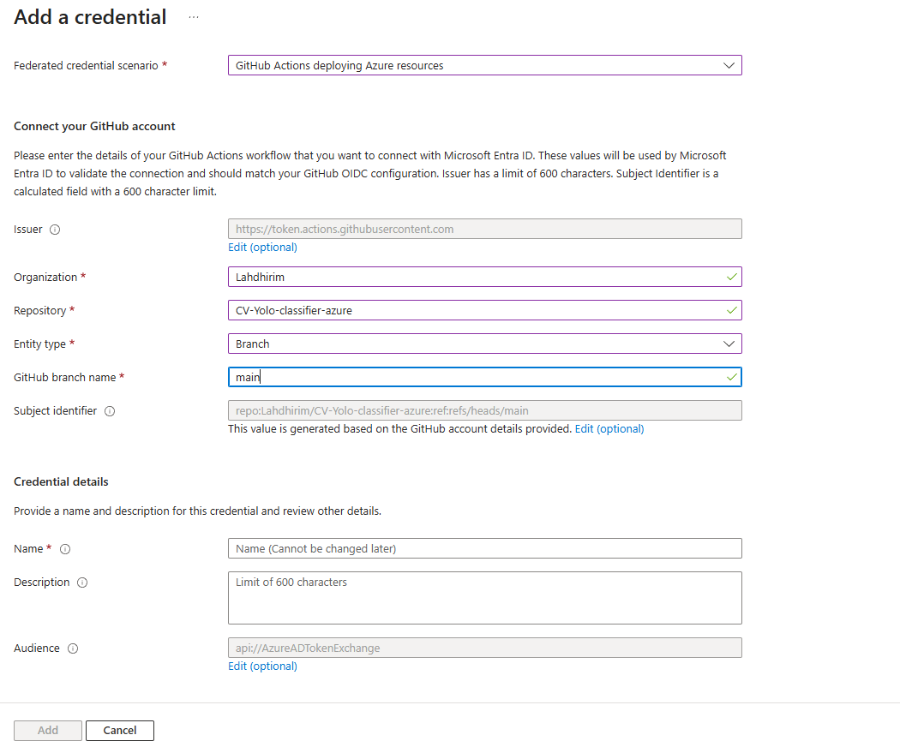
</div>

4. Assign the **Contributor** role to the registered application (`github-actions-yolo-classifier`) in your Azure resource group via the access control (IAM) settings. This will allow the application to manage resources.
5. In your GitHub repository, go to `Settings` > `Secrets and variables` > `Actions` > `New repository secret`. Add the following secrets:
   - `AZURE_CLIENT_ID`: The Application (client) ID of the registered application.
   - `AZURE_TENANT_ID`: The Directory (tenant) ID of your Azure subscription.
   - `AZURE_SUBSCRIPTION_ID`: The Subscription ID of your Azure subscription.